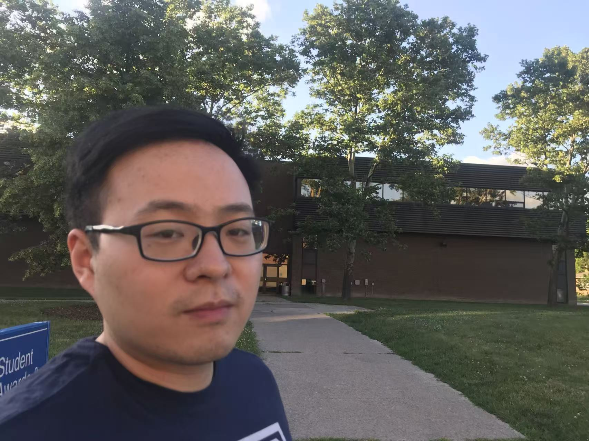

# Dr. Chenkai Chi — Personal Website

A clean, single-page academic website built from your CV (May 2026).
No build step — open `index.html` directly, or drop the folder on any static host.

## Files

```
website/
├── index.html        # all content (About, Research, Publications, Teaching, Grants, Service, Contact)
├── styles.css        # styling
├── script.js         # mobile nav + publications tab switcher
├── assets/           # put your photo here as portrait.jpg (optional)
└── cv/               # put your CV PDF here as Chenkai_Chi_CV.pdf (optional)
```

## To finish the site

1. **Add your photo.** Save a square headshot as `assets/portrait.jpg`, then in
   `index.html` replace the `<div class="photo-placeholder">…</div>` block with:
   ```html
   
   ```
   and add `.hero-photo img { width: 240px; height: 240px; border-radius: 50%; object-fit: cover; }` to `styles.css` (or keep the placeholder until you have a photo).

2. **Add your CV.** Export `Chenkai CV_20260512.docx` to PDF and save it at
   `cv/Chenkai_Chi_CV.pdf`. The "Download CV" buttons already point to this path.

3. **(Optional) Add ORCID / Google Scholar / LinkedIn links** in the hero CTA
   block in `index.html`.

## Hosting options

- **GitHub Pages** — create a repo `chenkaichi.github.io`, push the contents of
  this folder to the `main` branch root, enable Pages in repo Settings.
- **University server** — your IT department typically gives you a
  `~/public_html` folder; upload everything via SFTP.
- **Netlify / Cloudflare Pages** — drag the `website` folder onto their dashboard.

## Local preview

Open `index.html` directly in any browser. Or, if you want a local server:

```powershell
cd website
python -m http.server 8000
# then open http://localhost:8000
```
